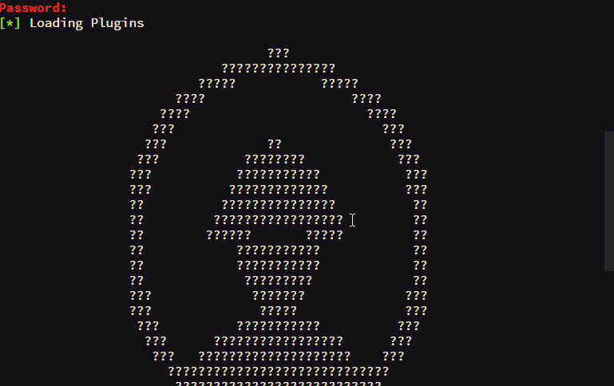

# Industrial Security Exploitation Framework

  

# 一、Overview

ISF(Industrial Security Exploitation Framework) is a exploitation framework based on Python. It's based on NSA Equation Group Fuzzbunch toolkit which is realsed by Shadow Broker. It's developed by the [**ICSMASTER Security Team**](http://icsmaster.com). Please use them only for researching purposes.

Read this in other languages: [English](./README.md), [简体中文](./README-ZH.md)

# 二、Requirements

- Python 2.7
- Works on Linux, Windows, Mac OSX, BSD

# 三、Modules

| Name                                   | Desc                                                                            |
| ---------------------------------------|:-------------------------------------------------------------------------------:|
| Schneider_CPU_Command                  | Control Schneider PLC CPU start or stop                                         |
| Siemens_300_400_CPU_Control            | Control Siemens PLC-300 and PLC-400 CPU start or stop                           |
| Siemens_1200_CPU_Control               | Control Siemens PLC-1200 CPU start or stop                                      |
| Modbus_PLC_Injecter                    | Modbus PLC injecter tools                                                       |
| plcscan                                | Modbus and S7 PLC scanner tools                                                 |
| lantronix_telnet_password              | Recover lantronix telnet password                                               |
| Siemens_1200_Control                   | Control Siemens PLC                                                             |

 
# 四、Usage

    C:\Users\w.hhh>python D:/isf/isf/isf.py
    [*] Loading Plugins

                                       ???
                                 ???????????????
                              ?????           ?????
                           ????                   ????
                         ????                       ????
                        ???                           ???
                       ???             ??              ???
                      ???           ????????            ???
                     ???           ???????????           ???
                     ???          ?????????????          ???
                     ??          ???????????????          ??
                     ??         ?????????????????         ??
                     ??        ??????       ?????         ??
                     ??            ???????????            ??
                     ??            ???????????            ??
                     ??             ?????????             ??
                     ???             ???????             ???
                     ???              ?????              ???
                      ???          ???????????          ???
                       ???      ?????????????????      ???
                        ???   ????????????????????    ???
                          ?????????????????????????????
                           ???????????????????????????
                              ?????????????????????
                                 ---ICSMASTER---

    + - - - - - + [ Version 1.1.1                           ] + - - - - - +
    + - - - - - + [ 6 Touches                               ] + - - - - - +
    + - - - - - + [ 10 Exploits                             ] + - - - - - +
    + - - - - - + [ 15 Payloads                             ] + - - - - - +
    + - - - - - + [ 2 Specials                              ] + - - - - - +
    + - - - - - + [ MADE BY ICSMASTER. HTTP://ICSMASTER.COM ] + - - - - - +

## show

Display module:

    isf > show

    Plugin Categories
    =================

      Category     Active Plugin
      --------     -------------
      Exploit      None
      Payload      None
      Special      None
      Touch        None

    isf > show Exploit

    Plugin Category: Exploit
    ========================

      Name                            Version
      ----                            -------
      ABB_CPU_Command                 1.1.0
      Beckhoff_CX9020_CPU_Control     1.1.0
      Schneider_CPU_Command           1.1.0
      Siemens_1200_CPU_Control        1.1.0
      Siemens_300_400_CPU_Control     1.1.0

    isf >

## use

Pick the module:

    isf > use Siemens_300_400_CPU_Control

    [!] Entering Plugin Context :: Siemens_300_400_CPU_Control
    [*] Applying Global Variables

    [*] Applying Session Parameters
    [*] Running Exploit Touches

    [!] Enter Prompt Mode :: Siemens_300_400_CPU_Control

    Module: Siemens_300_400_CPU_Control
    ===================================

      Name            Value
      ----            -----
      TargetIp
      TargetPort      102
      Slot            3
      Command         stop

    [!] plugin variables are valid
    [?] Prompt For Variable Settings? [Yes] :

## info

Display information about exploit:

    isf Exploit (Siemens_300_400_CPU_Control) > info

    Information
    ===========

        Name: Siemens_300_400_CPU_Control
     Version: 1.1.0
      Author: w3h
        Type: Exploit

    Parameters
    ==========

      Name            Value      Description
      ----            -----      -----------
      TargetIp                   Target IP Address
      TargetPort      102        Target Port
      Slot            3          The number of slot
      Command         stop       The control command of cpu

## set 

    isf Exploit (Siemens_300_400_CPU_Control) > set TargetIp 127.0.0.1
    [+] Set TargetIp => 127.0.0.1

## run/execute

Execute the module:

    isf Exploit (Siemens_300_400_CPU_Control) > run

    [!] Preparing to Execute Siemens_300_400_CPU_Control

    Module: Siemens_300_400_CPU_Control
    ===================================

      Name            Value
      ----            -----
      TargetIp        127.0.0.1
      TargetPort      102
      Slot            3
      Command         stop

    [?] Execute Plugin? [Yes] :

# 五、POC

[docs/USAGE.md](./docs/USAGE.md) 

# 六、Installation

## Requirements

* gnureadline (OSX only)
* pywin32 (Windows only)

## Installation on OSX

	git clone https://github.com/w3h/isf
	cd isf
	sudo easy_install pip
	sudo pip install -r requirements.txt
	./isf.py

## Installation on Ubuntu 16.04

	sudo apt-get install python-dev python-pip libncurses5-dev git
	git clone https://github.com/w3h/isf
	cd isf
	sudo pip install -r requirements.txt
	./isf.py

## Installation on Centos 7

	sudo yum install python-devel python2-pip ncurses-devel git
	git clone https://github.com/w3h/isf
    cd isf
	pip install -r requirements.txt
	./isf.py

## Installation on Windows

* install pywin32 (./dependencies/pywin32-221.win32-py2.7.exe)
* download isf (https://github.com/w3h/isf)
* start (python isf.py)
