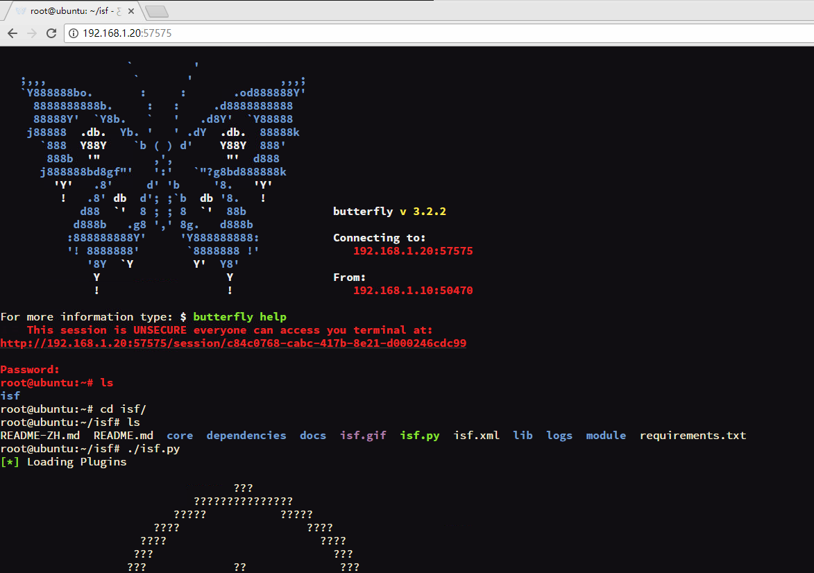

# Docker

制作本Dockerfile旨在一键部署[isf攻击框架](https://github.com/w3h/isf)。您只需在电脑中安装好docker，就可以使用Dockerfile一键部署isf框架，并且可以一键开启isf攻击框架！

此外，为了方便大家使用isf攻击框架，我们集成了[butterfly](https://github.com/paradoxxxzero/butterfly)网页终端(web terminal)，使我们可以从浏览器访问Linux系统的后台（类似ssh连接）。这样就使得一台isf攻击服务器，多人共同使用的场景成为可能，更大程度上方便了教学使用。

以下为安装教程：

1. 安装Docker

   **Ubuntu 16.04**

   请确保网络连接状态完好，国内用户推荐使用cn99的源

   ```
   apt-get install -y docker.io
   systemctl start docker
   ```

   **CentOS**

   ```
   yum install docker
   service docker start
   ```

   **其他平台：请参考[教程](http://www.runoob.com/docker/docker-tutorial.html)**

2. Docker使用

   请以root用户运行以下命令

   ```
   git clone https://github.com/w3h/isf_Docker
   cd isf_docker
   docker build -t isf:v1 .
   ```


   请确保网络状态良好，等待最后一步运行完毕后，运行如下指令，就可以从浏览器登录了

   ```
   docker run --net=host isf:v1 butterfly.server.py --host='0.0.0.0' --unsecure
   ```

   在浏览器中输入：http://ip:57575
   
   输入默认密码：123456，即可登录
   
   注:ip地址为Linux系统的ip地址,Ubuntu下使用ifconfig即可查看，CentOS可以输入ip addr察看
   
   登录完毕后，执行以下指令即可运行isf
   
   ```
   cd /root/isf/
   ./isf.py
   ```
   
   这是用浏览器打开的视图:
   
   
​	